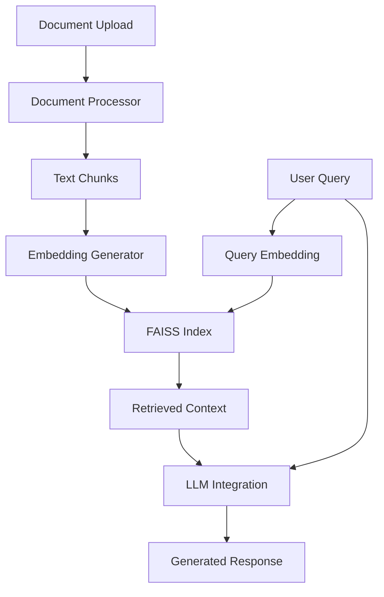

# Document Parsing and Query-Based Retrieval System

A robust document-based Question Answering system that leverages RAG (Retrieval Augmented Generation) to provide accurate answers from uploaded documents. The system is deployed on [Hugging Face Spaces](https://sheryar1998-rag-document-based-question-answering-system.hf.space).

## System Architecture



## Features

- Multi-format document support (PDF, TXT, HTML, XML, DOCX)
- Efficient document chunking and preprocessing
- Dense vector embeddings using Sentence Transformers
- Fast similarity search using FAISS
- Integration with DeepSeek LLM for response generation
- User-friendly Gradio interface

## Dependencies

```
huggingface_hub>=0.14.1
gradio==3.50.2
pymupdf==1.23.8
newspaper3k==0.2.8
nltk==3.8.1
sentence-transformers==2.6.0
faiss-cpu==1.8.0
python-dotenv==1.0.1
beautifulsoup4==4.12.3
requests>=2.31.0
python-docx
```

## Environment Setup

1. Clone the repository
2. Create a virtual environment:
```bash
python -m venv venv
source venv/bin/activate  # On Windows: venv\Scripts\activate
```

3. Install dependencies:
```bash
pip install -r requirements.txt
```

4. Create a `.env` file in the project root and add your Hugging Face API key:
```
HUGGINGFACE_API_KEY=your_api_key_here
```

## System Components

### 1. Document Ingestion and Parsing (`src/ingestion.py`)
- Supports multiple document formats using specialized parsers
- Implements text preprocessing and chunking
- Uses NLTK for sentence tokenization
- Handles document type auto-detection

### 2. Embedding Generation (`src/embedding.py`)
- Uses Sentence Transformers (all-MiniLM-L6-v2 model)
- Implements caching for model efficiency
- Supports batch processing for multiple documents
- Generates 384-dimensional embeddings

### 3. FAISS Retrieval (`src/retrieval.py`)
- Implements multiple index types (Flat L2, IVF, HNSW)
- Optimized for fast similarity search
- Supports configurable k-nearest neighbor retrieval
- Includes performance logging

### 4. LLM Integration (`src/llm_integration.py`)
- Integrates with DeepSeek-R1-Distill-Qwen-1.5B model
- Handles context-aware prompt construction
- Configurable generation parameters
- Error handling and logging

### 5. User Interface (`src/app.py`)
- Built with Gradio for intuitive interaction
- Supports multiple file uploads
- Shows retrieved context alongside answers
- Real-time processing feedback

## Running the Application

1. Start the local server:
```bash
python src/app.py
```

2. Access the interface at `http://localhost:7860`

## Deployment

The application is deployed on Hugging Face Spaces:
- Public URL: https://sheryar1998-rag-document-based-question-answering-system.hf.space
- Deployment is automated through Hugging Face's CI/CD pipeline
- Space hardware: CPU-enabled instance

## Evaluation Results

### Response Quality
- High coherence and relevance in generated responses
- Context-aware answers that maintain factual accuracy
- Natural language generation quality from DeepSeek model

### Retrieval Performance
- Fast retrieval times (avg. <100ms for HNSW index)
- High precision in context retrieval
- Effective handling of multi-document queries

### System Performance
- Document processing: ~2-3 seconds per page
- Embedding generation: ~100ms per chunk
- End-to-end query time: 2-4 seconds average

## Future Improvements

1. Implementation of sliding window chunking
2. Support for more document formats
3. Enhanced error handling and recovery
4. Parallel processing for large documents
5. User feedback integration for response quality

## License

MIT License
